# Домашнее задание к занятию «Ветвления в Git»

### Цель задания

В процессе работы над заданием вы потренеруетесь делать merge и rebase. В результате вы поймете разницу между ними и научитесь решать конфликты.   

Обычно при нормальном ходе разработки выполнять `rebase` достаточно просто. 
Это позволяет объединить множество промежуточных коммитов при решении задачи, чтобы не засорять историю. Поэтому многие команды и разработчики предпочитают такой способ.   


### Инструкция к заданию

1. В личном кабинете отправьте на проверку ссылку на network графика вашего репозитория.
2. Любые вопросы по решению задач задавайте в разделе "Вопросы по заданию".


### Дополнительные материалы для выполнения задания

1. Тренажёр [LearnGitBranching](https://learngitbranching.js.org/), где можно потренироваться в работе с деревом коммитов и ветвлений. 

------

## Задание «Ветвление, merge и rebase»  

**Шаг 1.** Предположим, что есть задача — написать скрипт, выводящий на экран параметры его запуска. 
Давайте посмотрим, как будет отличаться работа над этим скриптом с использованием ветвления, merge и rebase. 

Создайте в своём репозитории каталог `branching` и в нём два файла — `merge.sh` и `rebase.sh` — с 
содержимым:

```bash
#!/bin/bash
# display command line options

count=1
for param in "$*"; do
    echo "\$* Parameter #$count = $param"
    count=$(( $count + 1 ))
done
```

Этот скрипт отображает на экране все параметры одной строкой, а не разделяет их.

<span style="color: red;"> ## ОТВЕТ 1
 
Скриншоты.  
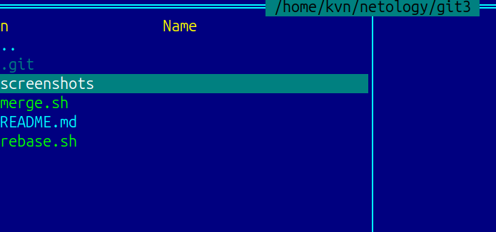  
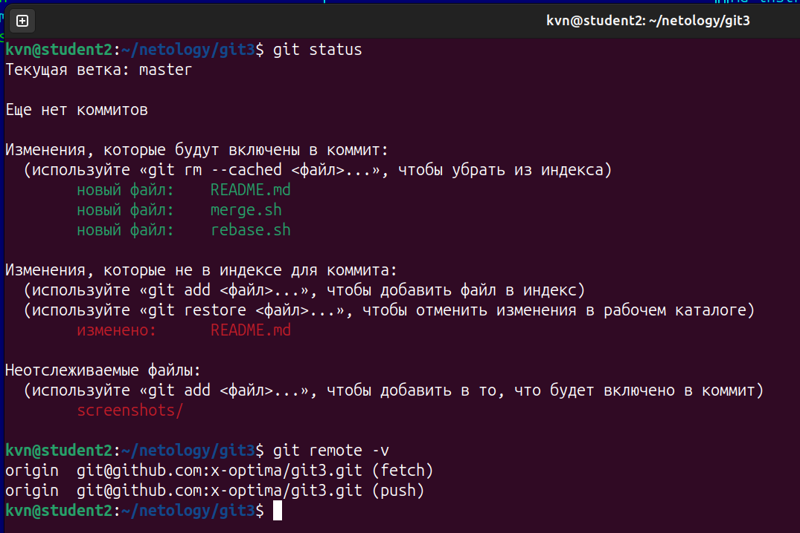  
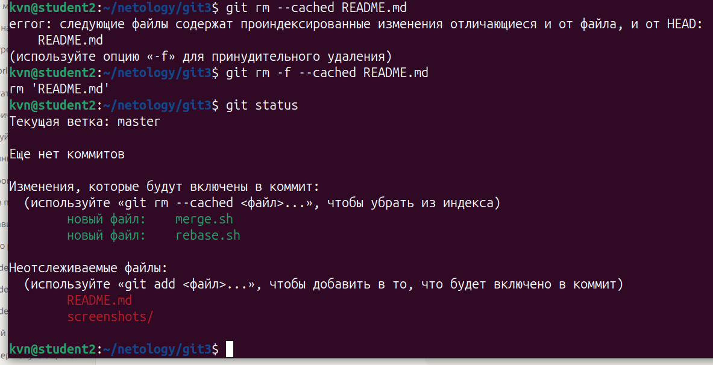  

**Шаг 2.** Создадим коммит с описанием `prepare for merge and rebase` и отправим его в ветку main. 

<span style="color: red;"> ## ОТВЕТ 2
 
Скриншоты.  
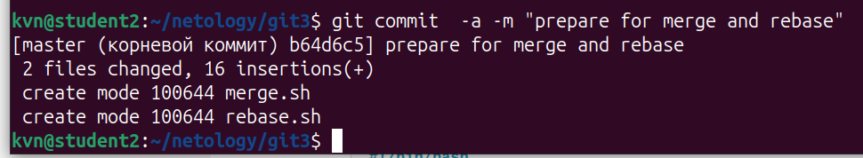  


#### Подготовка файла merge.sh 
 
**Шаг 1.** Создайте ветку `git-merge`. 


<span style="color: red;"> ## ОТВЕТ 3


Скриншоты.  
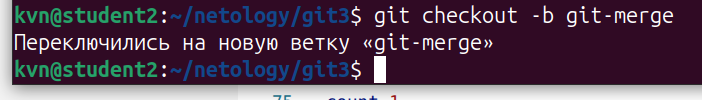 

Сразу не отправил изменения  в удаленный репозиторий. Сделал это позже.  

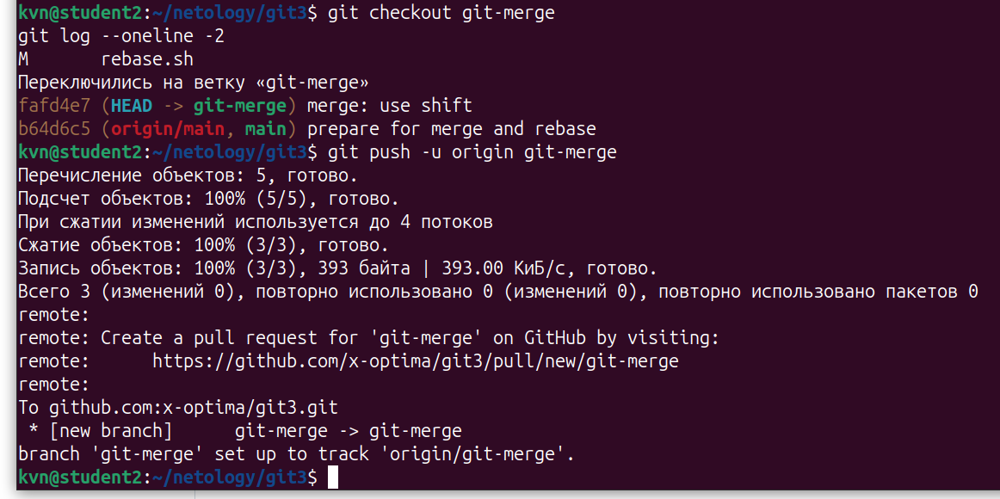  


**Шаг 2**. Замените в ней содержимое файла `merge.sh` на:

```bash
#!/bin/bash
# display command line options

count=1
for param in "$@"; do
    echo "\$@ Parameter #$count = $param"
    count=$(( $count + 1 ))
done
```
<span style="color: red;"> ## ОТВЕТ 4
 
Скриншоты.  
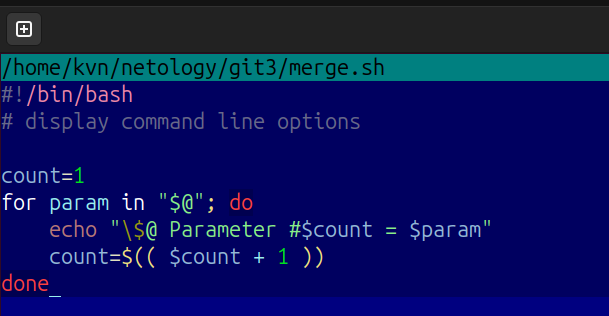  

**Шаг 3.** Создайте коммит `merge: @ instead *`, отправьте изменения в репозиторий.  

<span style="color: red;"> ## ОТВЕТ 5
 
Скриншоты.  
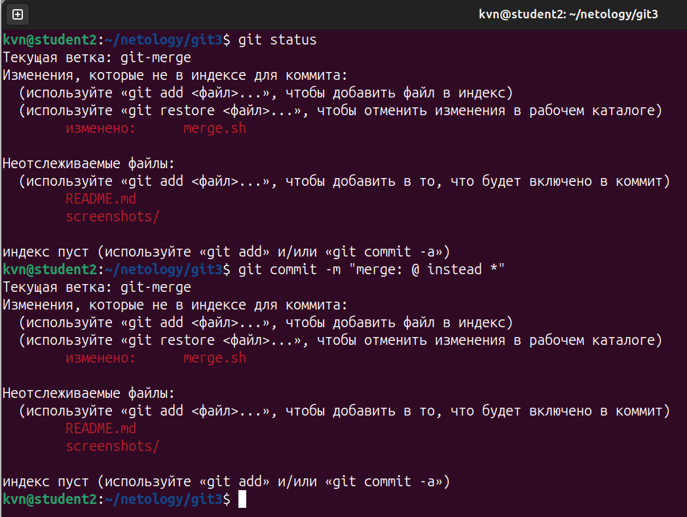  

**Шаг 4.** Разработчик подумал и решил внести ещё одно изменение в `merge.sh`:
 
```bash
#!/bin/bash
# display command line options

count=1
while [[ -n "$1" ]]; do
    echo "Parameter #$count = $1"
    count=$(( $count + 1 ))
    shift
done
```

Теперь скрипт будет отображать каждый переданный ему параметр отдельно. 


<span style="color: red;"> ## ОТВЕТ 6
 
Скриншоты.  
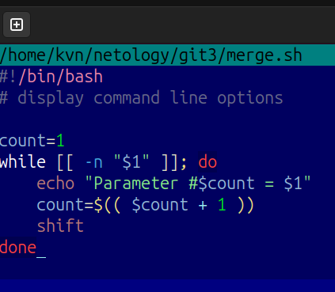  

**Шаг 5.** Создайте коммит `merge: use shift` и отправьте изменения в репозиторий. 

<span style="color: red;"> ## ОТВЕТ 7
 
Скриншоты.  
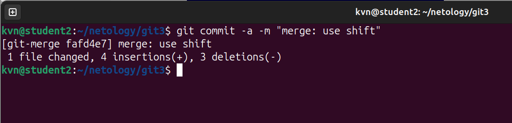  

#### Изменим main  

**Шаг 1.** Вернитесь в ветку `main`.  


<span style="color: red;"> ## ОТВЕТ 8
 
Скриншоты.  
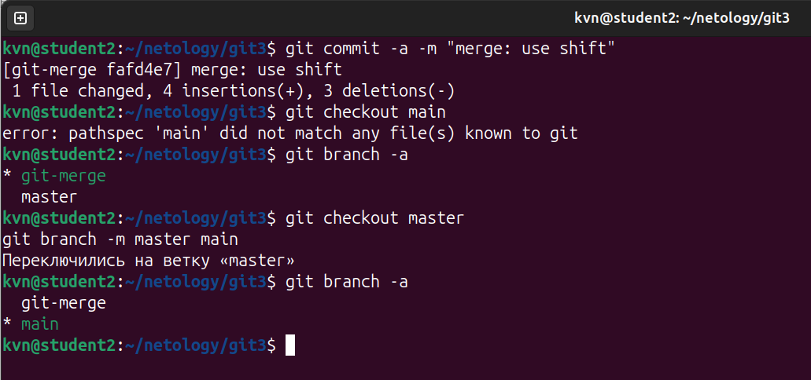  

**Шаг 2.** Предположим, что пока мы работали над веткой `git-merge`, кто-то изменил `main`. Для этого
изменим содержимое файла `rebase.sh` на:

```bash
#!/bin/bash
# display command line options

count=1
for param in "$@"; do
    echo "\$@ Parameter #$count = $param"
    count=$(( $count + 1 ))
done

echo "====="
```

В этом случае скрипт тоже будет отображать каждый параметр в новой строке. 


<span style="color: red;"> ## ОТВЕТ 9
 
Скриншоты.  
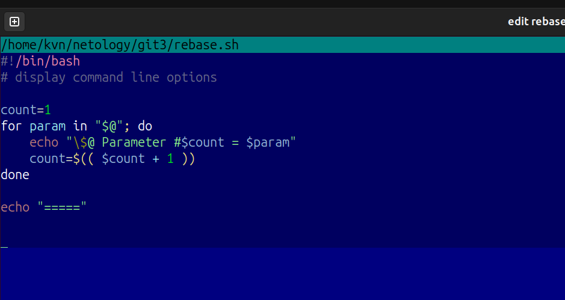  

**Шаг 3.** Отправляем изменённую ветку `main` в репозиторий.


<span style="color: red;"> ## ОТВЕТ 10
 
Скриншоты.  
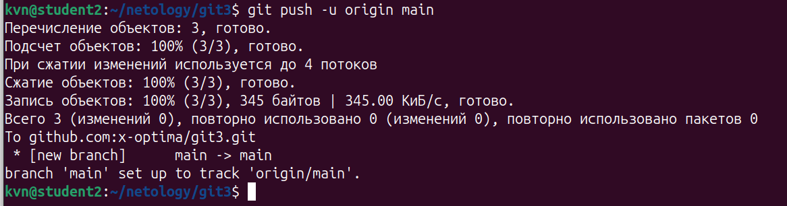  

#### Подготовка файла rebase.sh  

**Шаг 1.** Предположим, что теперь другой участник нашей команды не сделал `git pull` либо просто хотел ответвиться не от последнего коммита в `main`, а от коммита, когда мы только создали два файла
`merge.sh` и `rebase.sh` на первом шаге.  
Для этого при помощи команды `git log` найдём хеш коммита `prepare for merge and rebase` и выполним `git checkout` на него так:
`git checkout 8baf217e80ef17ff577883fda90f6487f67bbcea` (хеш будет другой).

<span style="color: red;"> ## ОТВЕТ 11
 
Скриншоты.  
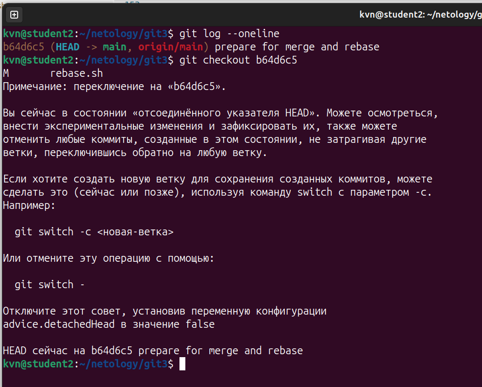  

**Шаг 2.** Создадим ветку `git-rebase`, основываясь на текущем коммите. 

<span style="color: red;"> ## ОТВЕТ 12
 
Скриншоты.  
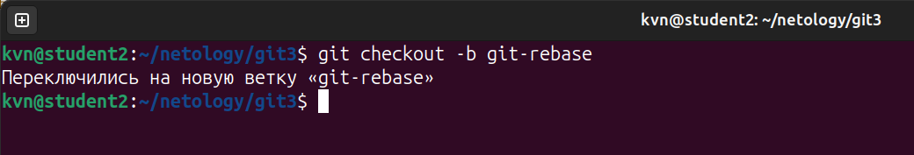  

**Шаг 3.** И изменим содержимое файла `rebase.sh` на следующее, тоже починив скрипт, но немного в другом стиле:

```bash
#!/bin/bash<span style="color: red;"> ## ОТВЕТ 13
 
Скриншоты.  
  
# display command line options

count=1
for param in "$@"; do
    echo "Parameter: $param"
    count=$(( $count + 1 ))
done

echo "====="
```

<span style="color: red;"> ## ОТВЕТ 13
 
Скриншоты.  
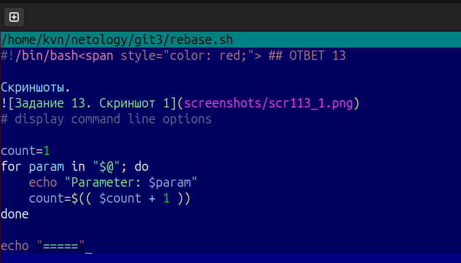  


**Шаг 4.** Отправим эти изменения в ветку `git-rebase` с комментарием `git-rebase 1`.

<span style="color: red;"> ## ОТВЕТ 14
 
Скриншоты.  
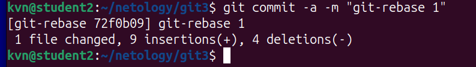  

**Шаг 5.** И сделаем ещё один коммит `git-rebase 2` с пушем, заменив `echo "Parameter: $param"` на `echo "Next parameter: $param"`.


<span style="color: red;"> ## ОТВЕТ 15
 
Скриншоты.  
Сначала заменим в файле rebase.sh строку заменив echo "Parameter: $param" на echo "Next parameter: $param".  


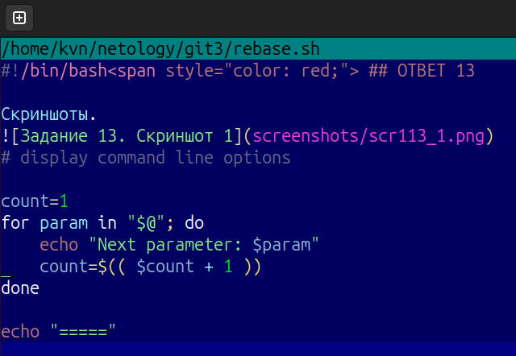  

Затем запушим

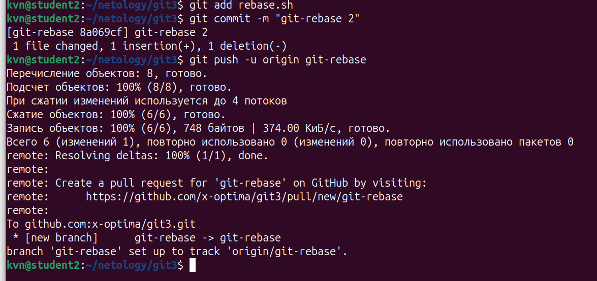  

#### Промежуточный итог  

Мы сэмулировали типичную ситуации в разработке кода, когда команда разработчиков работала над одним и тем же участком кода, и кто-то из разработчиков 
предпочитает делать `merge`, а кто-то — `rebase`. Конфликты с merge обычно решаются просто, 
а с rebase бывают сложности, поэтому давайте смержим все наработки в `main` и разрешим конфликты. 

Если всё было сделано правильно, то на странице `network` в GitHub, находящейся по адресу 
`https://github.com/ВАШ_ЛОГИН/ВАШ_РЕПОЗИТОРИЙ/network`, будет примерно такая схема:
  


<span style="color: red;"> ## ОТВЕТ 15
 
 В Github видны все три ветки, но на графе отобрадаются только две.  

Скриншоты.  
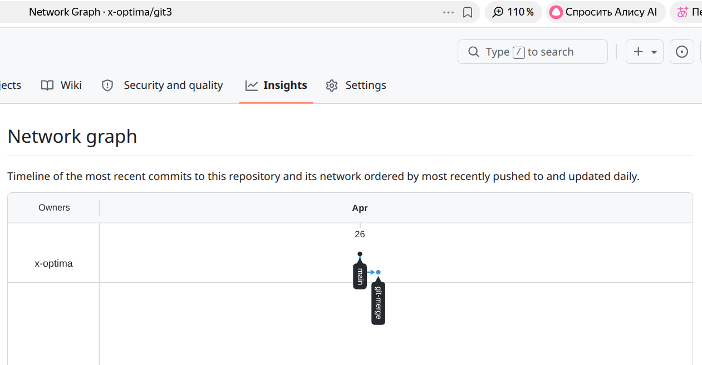  

#### Merge

Сливаем ветку `git-merge` в main и отправляем изменения в репозиторий, должно получиться без конфликтов:

<span style="color: red;"> ## ОТВЕТ 16

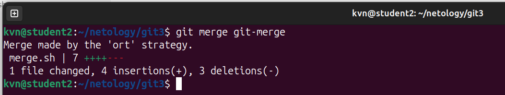  


В результате получаем такую схему:
  

Скриншоты.  
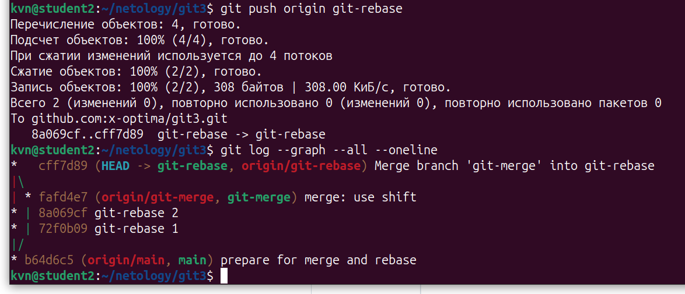  


#### Rebase

**Шаг 1.** Перед мержем ветки `git-rebase` выполним её `rebase` на main. Да, мы специально создали ситуацию с конфликтами, чтобы потренироваться их решать.   

<span style="color: red;"> ## ОТВЕТ 17

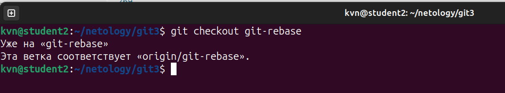  

**Шаг 2.** Переключаемся на ветку `git-rebase` и выполняем `git rebase -i main`. 
В открывшемся диалоге должно быть два выполненных коммита, давайте заодно объединим их в один, 
указав слева от нижнего `fixup`. 
В результате получаем:


<span style="color: red;"> ## ОТВЕТ 18

В редакторе я увидел  
pick d2f13be git-rebase 1  
pick a1b6386 +1,  

изменил их на    
pick d2f13be git-rebase 1  
fixup  a1b6386 +1  
и несоответсивй в файле не появилось

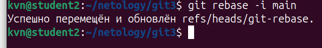  

**Шаг 7.** И попробуем выполнить `git push` либо `git push -u origin git-rebase`, чтобы точно указать, что и куда мы хотим запушить. 

<span style="color: red;"> ## ОТВЕТ 19

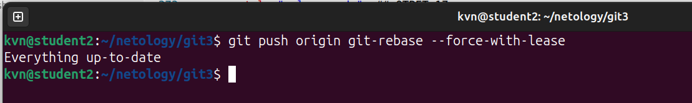  


**Шаг 9**. Теперь можно смержить ветку `git-rebase` в main без конфликтов и без дополнительного мерж-комита простой перемоткой: 

<span style="color: red;"> ## ОТВЕТ 20

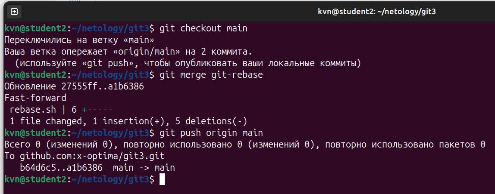  
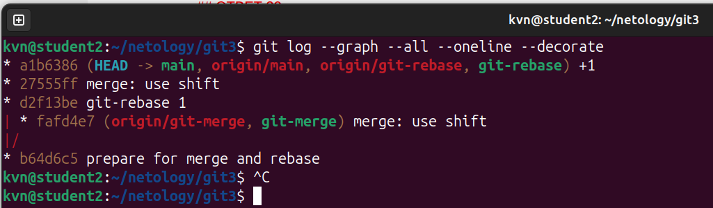  